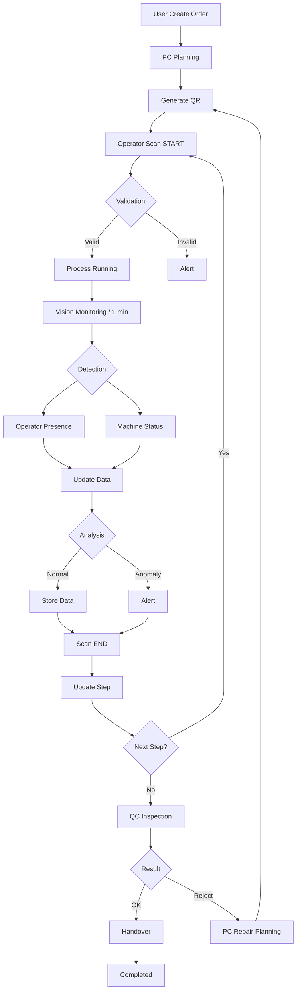

# 🚀 ProdEye (Production Eye)

**Smart Production Tracking & Validation System**

ProdEye adalah sistem berbasis web untuk memantau, mencatat, dan memvalidasi proses produksi machining secara real-time menggunakan kombinasi QR Tracking, Computer Vision, dan Live Analytics.

---

# 📌 Overview

Dalam industri manufaktur machining (CNC Milling, Bubut, Grinding), pencatatan proses produksi sering masih dilakukan secara manual dan tidak tervalidasi. Hal ini menyebabkan:

- Kurangnya visibilitas proses produksi
- Data waktu kerja tidak akurat
- Potensi manipulasi aktivitas
- Sulit mendeteksi anomali secara cepat

**ProdEye hadir untuk mengatasi masalah tersebut dengan pendekatan berbasis data, real-time monitoring, dan validasi otomatis.**

---

# 🎯 Key Features

## 1. QR Tracking (Production Control)
- Scan QR untuk START / END proses
- Server-based timestamp (anti manipulasi)
- Sequence validation (anti jumping process)

## 2. Computer Vision Monitoring
- Capture otomatis setiap 1 menit
- Deteksi:
  - Kehadiran operator (ada / tidak)
  - Status mesin via lampu indikator:
    - 🔴 Merah → OFF / Error
    - 🟡 Kuning → Idle
    - 🟢 Hijau → Running

## 3. Anomaly Detection
- Mesin running tanpa operator
- Mesin idle terlalu lama
- Aktivitas tidak sesuai kondisi nyata
- Alert otomatis real-time

## 4. Live Analytics Dashboard
- Status mesin real-time
- Progress order
- Estimasi vs aktual
- Riwayat anomali

---

# 🏭 Use Case (Machining Process)

Digunakan pada proses produksi seperti:

- CNC Milling → pembentukan part presisi
- Lathe (Bubut) → pembentukan silinder
- Grinding → finishing permukaan

Setiap part melewati beberapa step mesin secara berurutan.

---

# 🔄 Workflow

---

# 🧠 System Architecture

## Frontend

* Next.js (App Router)
* Tailwind CSS
* PWA Support (Tablet-friendly)

## Backend

* Next.js API Routes
* REST API

## Database

* PostgreSQL

## Storage

* Azure Blob Storage

## AI & Vision

* YOLOv8

  * Object Detection (person)
  * Image classification (lamp status)

## Real-time

* WebSocket

---

# 🗄️ Core Data Model

### Users

* id, name, role (user, pc, operator, inspector, admin)

### Orders

* order_number, part_name, quantity, status

### Process Plans

* step_number, machine, estimated_minutes, status

### QR Scans

* action (start/end), timestamp, user

### Vision Logs

* machine_status (red/yellow/green)
* operator_presence (true/false)

### Anomalies

* type, severity, timestamp

---

# 🔒 Validation Rules

* Tidak bisa START jika step sebelumnya belum selesai
* Tidak bisa lompat step (anti jumping)
* Tidak bisa END tanpa START
* Semua waktu menggunakan server timestamp

---

# ⚠️ Anomaly Detection Rules

| Rule            | Kondisi                       |
| --------------- | ----------------------------- |
| No Operator     | Mesin running tanpa operator  |
| Idle Too Long   | Mesin idle melebihi threshold |
| Invalid Scan    | Scan tidak sesuai kondisi     |
| Jumping Process | Step dilompati                |

---

# ☁️ Azure Integration

ProdEye menggunakan layanan cloud untuk:

* Storage (image snapshot, QR code, gambar kerja)
---

# 🧰 Teknologi yang Digunakan

| Komponen | Teknologi | Keterangan |
|----------|-----------|-----------|
| Frontend | Next.js 14 (App Router), Tailwind CSS, shadcn/ui | Web app responsif + PWA untuk tablet |
| Backend | Next.js API Routes | Monorepo, mudah integrasi frontend |
| Database | PostgreSQL | Relasional, kuat untuk transaksi |
| Real-time | WebSocket | Update dashboard real-time |
| Computer Vision | YOLOv8 | Deteksi operator & status lampu |
| QR Generator | qrcode (npm) | Generate QR PNG/SVG |
| QR Scanner | html5-qrcode | Scan via kamera browser |
| File Storage | Azure Blob Storage | Gambar kerja, snapshot kamera |

---

# 🗄️ Desain Database

## 1. Tabel: `users`

| Kolom | Tipe Data | Constraint | Keterangan |
|------|----------|------------|------------|
| id | UUID | PK | ID unik user |
| name | VARCHAR(100) | NOT NULL | Nama user |
| email | VARCHAR(255) | UNIQUE, NOT NULL | Email login |
| password_hash | VARCHAR(255) | NOT NULL | Password (bcrypt) |
| role | ENUM | NOT NULL | user, pc, operator, inspector, admin |
| machine_id | UUID | FK | Mesin khusus operator |
| is_active | BOOLEAN | DEFAULT true | Status user |
| created_at | TIMESTAMP | DEFAULT now() | Waktu dibuat |

---

## 2. Tabel: `orders`

| Kolom | Tipe Data | Constraint | Keterangan |
|------|----------|------------|------------|
| id | UUID | PK | ID order |
| order_number | VARCHAR(20) | UNIQUE | Nomor order |
| part_name | VARCHAR(200) | NOT NULL | Nama part |
| quantity | INTEGER | NOT NULL | Jumlah |
| status | ENUM | NOT NULL | draft → completed |
| requester_id | UUID | FK | User pemesan |
| created_at | TIMESTAMP | DEFAULT now() | Waktu dibuat |

---

## 3. Tabel: `process_plans`

| Kolom | Tipe Data | Constraint | Keterangan |
|------|----------|------------|------------|
| id | UUID | PK | ID step |
| order_id | UUID | FK | Relasi ke order |
| step_number | INTEGER | NOT NULL | Urutan proses |
| machine_id | UUID | FK | Mesin |
| estimated_minutes | DECIMAL | NOT NULL | Estimasi waktu |
| status | ENUM | NOT NULL | waiting / in_progress / done |
| started_at | TIMESTAMP | | Waktu mulai |
| ended_at | TIMESTAMP | | Waktu selesai |
| actual_minutes | DECIMAL | | Durasi aktual |

---

## 4. Tabel: `machines`

| Kolom | Tipe Data | Constraint | Keterangan |
|------|----------|------------|------------|
| id | UUID | PK | ID mesin |
| name | VARCHAR(100) | NOT NULL | Nama mesin |
| type | VARCHAR(50) | | CNC, Bubut, dll |
| location | VARCHAR(100) | | Lokasi |
| is_active | BOOLEAN | DEFAULT true | Status |

---

## 5. Tabel: `qr_scans`

| Kolom | Tipe Data | Constraint | Keterangan |
|------|----------|------------|------------|
| id | UUID | PK | ID scan |
| order_id | UUID | FK | Order |
| step_number | INTEGER | NOT NULL | Step |
| action | ENUM | NOT NULL | start / end |
| scanned_by | UUID | FK | User |
| scanned_at | TIMESTAMP | NOT NULL | Server timestamp |

---

## 6. Tabel: `vision_logs`

| Kolom | Tipe Data | Constraint | Keterangan |
|------|----------|------------|------------|
| id | UUID | PK | ID log |
| machine_id | UUID | FK | Mesin |
| operator_present | BOOLEAN | | Ada operator? |
| machine_status | ENUM | | red / yellow / green |
| confidence | FLOAT | | Confidence AI |
| captured_at | TIMESTAMP | DEFAULT now() | Waktu capture |

---

## 7. Tabel: `anomalies`

| Kolom | Tipe Data | Constraint | Keterangan |
|------|----------|------------|------------|
| id | UUID | PK | ID anomaly |
| order_id | UUID | FK | Order |
| step_number | INTEGER | | Step |
| type | VARCHAR(50) | | jenis anomaly |
| severity | ENUM | | warning / critical |
| message | TEXT | | Deskripsi |
| created_at | TIMESTAMP | DEFAULT now() | Waktu |

---

# 🔗 API Endpoints

## 🔐 Authentication
| Method | Endpoint | Deskripsi |
|--------|----------|-----------|
| POST | /api/auth/login | Login user |

---

## 📦 Orders
| Method | Endpoint | Deskripsi |
|--------|----------|-----------|
| POST | /api/orders | Buat order |
| GET | /api/orders | List order |
| GET | /api/orders/:id | Detail order |

---

## 🏭 Production Control (PC)
| Method | Endpoint | Deskripsi |
|--------|----------|-----------|
| POST | /api/orders/:id/register | Registrasi & planning |
| GET | /api/orders/:id/qr | Generate QR |
| GET | /api/dashboard/machines | Status mesin |

---

## 👷 Operator
| Method | Endpoint | Deskripsi |
|--------|----------|-----------|
| GET | /api/operator/queue | Antrian kerja |
| POST | /api/scans/start | Mulai proses |
| POST | /api/scans/end | Selesai proses |

---

## 🔍 Inspector
| Method | Endpoint | Deskripsi |
|--------|----------|-----------|
| GET | /api/inspection/queue | Antrian QC |
| POST | /api/inspection/complete | Hasil QC |

---

## ⚠️ Monitoring & Vision
| Method | Endpoint | Deskripsi |
|--------|----------|-----------|
| POST | /api/vision/capture | Kirim image ke AI |
| GET | /api/vision/logs | Data monitoring |
| GET | /api/anomalies | List anomaly |

---

## ⚙️ Admin
| Method | Endpoint | Deskripsi |
|--------|----------|-----------|
| CRUD | /api/admin/users | Kelola user |
| CRUD | /api/admin/machines | Kelola mesin |
| CRUD | /api/admin/materials | Kelola material |

---

# 🚀 Future Development

* IoT Integration (direct machine data)
* Predictive Maintenance
* AI-based Production Forecasting
* Mobile App (Android/iOS)
* Multi-plant support
* ERP Integration
* Advanced Computer Vision (activity detection)

---

# 💡 Value Proposition

ProdEye bukan hanya sistem tracking, tetapi:

* ✅ **Traceability** → Semua proses tercatat
* ✅ **Validation** → Aktivitas diverifikasi AI
* ✅ **Visibility** → Monitoring real-time
* ✅ **Control** → Anti manipulasi & anti error
* ✅ **Insight** → Data untuk decision making

---

# 📊 Summary

ProdEye mengubah proses produksi dari:

> "Sekadar tercatat"

Menjadi:

> **"Tervalidasi, transparan, dan real-time"**

---

# 👨‍💻 Author

Developed for Microsoft Hackathon
Smart Manufacturing Solution 🚀
